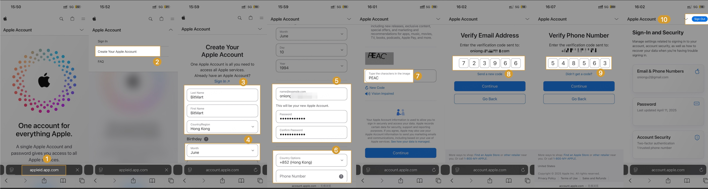
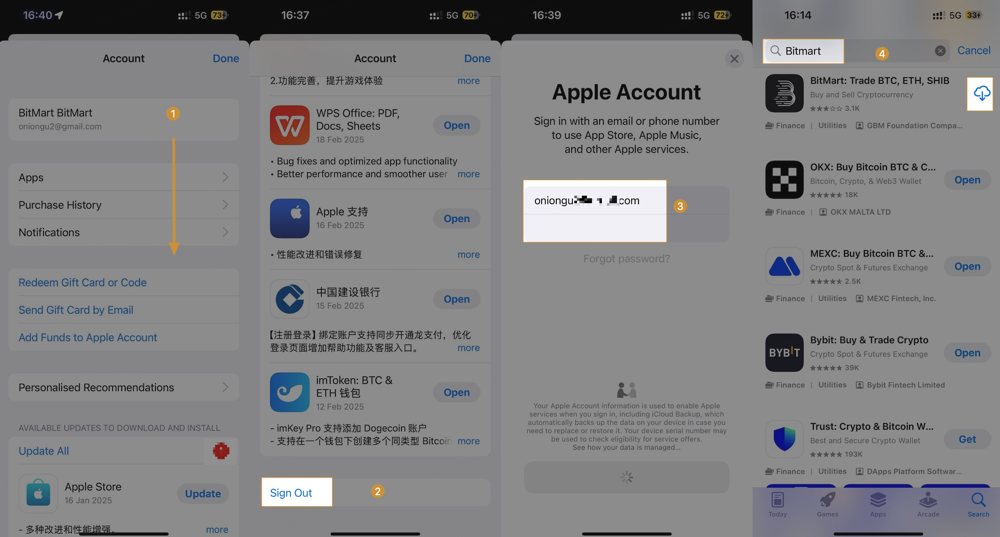
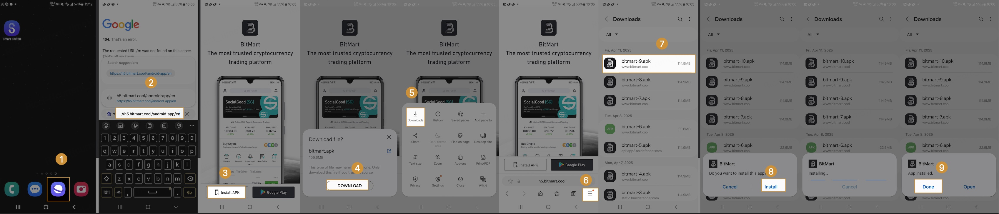

# 一.How to download and install the BitMart mobile app (iOS/Android)
## (1) iOS Tutorial
Register a new Apple ID, log in to the App Store, and download the App. The detailed steps are as follows:

#### 1.Register a new account
* Step 1: Use Safari browser to visit Apple's official website https://appleid.apple.com/account
* Step 2: Click the drop-down menu in the upper right corner >> Select [Create New Apple Account]
* Step 3: Enter your name and country [Hong Kong]
  * Note that country selection: Netherlands, Afghanistan, Morocco, India, United Kingdom, Mainland China, etc. are not supported, and all others are optional
* Step 4: Select your birthday, fill in your commonly used email address, and mobile phone number
* Step 5: After entering the email address and mobile phone verification code, click [Continue]. If the registration is successful, you will see the sign out button.

#### 2.Log in to a new account and search for downloads
* Step 1: Log out of the logged-in Apple ID
* Step 2: Log in to the newly registered Apple ID and enter [Bitmart] to search and download

## (2) Android Tutorials
You can copy the following link directly and open it in your mobile browser to complete the download and installation.

    * Download link 1: https://h5.bitmart.com/android-app/en
    * Download link 2: https://h5.bitmart.cool/android-app/en

* Step 1: Open the link in your mobile browser, and click [Install APK] to download the BitMart App.
* Step 2: After downloading, go to the download list and click [bitmart.apk] to install
* Step 3: If a prompt pops up during installation, just continue to select [install]. The last word Done indicates that the installation is complete

#### Follow the graphic tutorial

