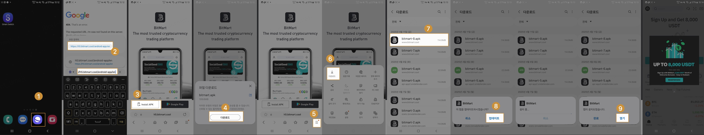

# 一.BitMart 모바일 앱 다운로드 및 설치 방법 (iOS 버전/Android 버전)
## 1. iOS 튜토리얼

#### Register a new account
* Step 1: Use Safari browser to visit Apple's official website https://appleid.apple.com/account
* Step 2: Click the drop-down menu in the upper right corner >> Select [Create New Apple Account]
* Step 3: Enter your name and country [Hong Kong]
    * Note that country selection: Netherlands, Afghanistan, Morocco, India, United Kingdom, Mainland China, etc. are not supported, and all others are optional
* Step 4: Select your birthday, fill in your commonly used email address, and mobile phone number
* Step 5: After entering the email address and mobile phone verification code, click [Continue]. If the registration is successful, you will see the sign out button.

#### Log in to a new account and search for downloads
* Step 1: Log out of the logged-in Apple ID
* Step 2: Log in to the newly registered Apple ID and enter [Bitmart] to search and download

## 2. 안드로이드 튜토리얼
다음 링크를 직접 복사하여 모바일 브라우저에서 열어 다운로드 및 설치를 완료할 수 있습니다.

    * 다운로드 링크 1：https://h5.bitmart.com/android-app/en
    * 다운로드 링크 2：https://h5.bitmart.cool/android-app/en

* 1단계: 휴대폰에서 브라우저를 엽니다.
* 2단계: 링크를 브라우저 입력란에 복사한 후 [이동] 버튼을 클릭하면 다운로드 페이지로 이동합니다.
* 3단계 : 다운로드 페이지에서 왼쪽의 [Install APK] 버튼을 선택하고 클릭하세요.
* 4단계 : 다운로드 시 다운로드 안내가 나오면 [다운로드] 버튼을 계속 클릭해주세요.
* 5단계 : 다운로드를 클릭한 후 메뉴 페이지로 돌아와서 [메뉴] 버튼을 클릭하세요. 브라우저 메뉴 목록이 표시됩니다.
* 6단계 : 메뉴 목록에서 [다운로드]를 클릭하여 다운로드 관리 기록 페이지로 진입합니다.
* 7단계: 다운로드 관리 기록 페이지에서 방금 다운로드한 bimtart.apk를 찾은 다음 이 apk를 클릭하여 설치합니다.
* 8단계: 설치 중에 메시지가 팝업되면 [설치] 버튼을 클릭하세요.
* 9단계 : 설치가 완료되면 [열기]를 클릭하여 엽니다.

#### 그래픽 튜토리얼을 따르세요

