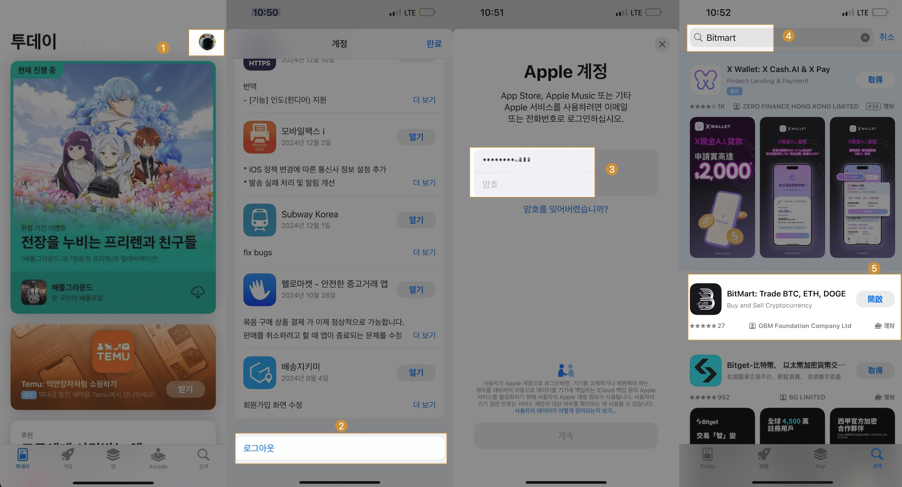

# 一.BitMart 모바일 앱 다운로드 및 설치 방법 (iOS 버전/Android 버전)
## (1). iOS 튜토리얼

#### 1. 새 계정 등록하기

* Step 1: Safari 브라우저를 사용하여 Apple 공식 웹사이트 https://appleid.apple.com/account 에 접속합니다.
* Step 2: 오른쪽 상단의 드롭다운 메뉴를 클릭한 후 [새로운 Apple 계정 만들기]를 선택합니다.
* Step 3: 이름과 국가를 입력합니다. 국가 선택 시 [홍콩]으로 설정하세요.
  * 국가 선택 주의사항: 네덜란드, 아프가니스탄, 모로코, 인도, 영국, 중국 본토, 한국 등은 지원되지 않으며, 이 외 대부분의 국가는 선택 가능합니다.
* Step 4: 생년월일을 선택하고 자주 사용하는 이메일 주소와 휴대폰 번호를 입력합니다.
* Step 5: 입력한 이메일 주소와 휴대폰 번호로 전송된 인증 코드를 입력한 후 [계속]을 클릭하세요. 등록이 성공적으로 완료되면, '로그아웃'버튼이 표시됩니다.

#### 2.새 계정으로 로그인하고 앱 검색 및 다운로드하기
* Step 1-2: 현재 로그인되어 있는 Apple ID에서 로그아웃합니다.
* Step 3-4: 새로 등록한 Apple ID로 로그인한 후, [Bitmart] 를 검색하여 다운로드합니다.

## (2). 안드로이드 튜토리얼
다음 링크를 직접 복사하여 모바일 브라우저에서 열어 다운로드 및 설치를 완료할 수 있습니다.

    * 다운로드 링크 1：https://h5.bitmart.com/android-app/en
    * 다운로드 링크 2：https://h5.bitmart.cool/android-app/en

* 1단계: 휴대폰에서 브라우저를 엽니다.
* 2단계: 링크를 브라우저 입력란에 복사한 후 [이동] 버튼을 클릭하면 다운로드 페이지로 이동합니다.
* 3단계 : 다운로드 페이지에서 왼쪽의 [Install APK] 버튼을 선택하고 클릭하세요.
* 4단계 : 다운로드 시 다운로드 안내가 나오면 [다운로드] 버튼을 계속 클릭해주세요.
* 5단계 : 다운로드를 클릭한 후 메뉴 페이지로 돌아와서 [메뉴] 버튼을 클릭하세요. 브라우저 메뉴 목록이 표시됩니다.
* 6단계 : 메뉴 목록에서 [다운로드]를 클릭하여 다운로드 관리 기록 페이지로 진입합니다.
* 7단계: 다운로드 관리 기록 페이지에서 방금 다운로드한 bimtart.apk를 찾은 다음 이 apk를 클릭하여 설치합니다.
* 8단계: 설치 중에 메시지가 팝업되면 [설치] 버튼을 클릭하세요.
* 9단계 : 설치가 완료되면 [열기]를 클릭하여 엽니다.

#### 그래픽 튜토리얼을 따르세요

