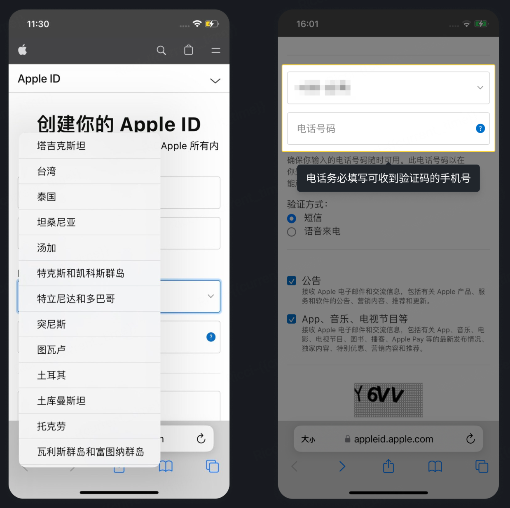
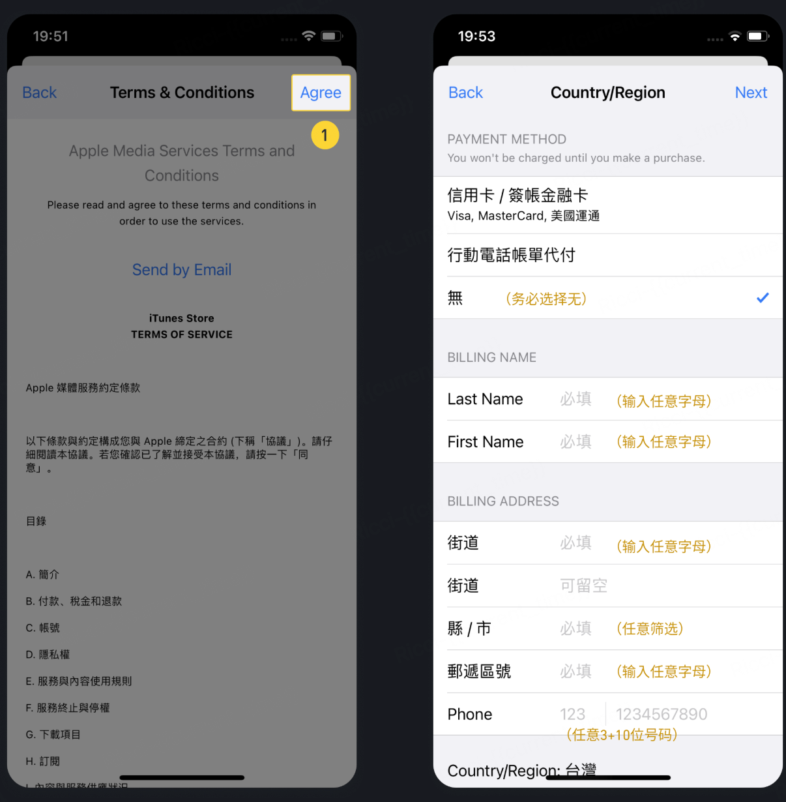

# 一.如何下载及安装 iOS APP（无VPN）
注册新的Apple ID，登录App Store，下载App，详细步骤如下：

* 步骤一：访问苹果官方网站 https://appleid.apple.com/account

    

  
* 步骤二：点击右上角下拉菜单 >> 选择"创建你的 Apple ID"
  * 请务必记住用来注册账户的邮箱、密码及手机号码。
  * 目前除了荷兰,阿富汗,摩洛哥,印度,英国,中国大陆等不支持，其他都可选。

    

* 步骤三：选择"地区"，填写常用邮箱，提供能够收到验证码的手机号码。
  * 请务必记住用来注册账户的邮箱、密码及手机号码。
  * 在下图中荷兰,阿富汗,摩洛哥,印度,英国,中国大陆,韩国等不支持，目前BitMart APP暂不支持，其他都可选。

    

* 步骤四：输入邮箱和手机收到的验证码后，即可成功注册 Apple ID

    

* 步骤五：打开 App Store >> 登录新注册的 Apple ID 和密码

    

* 步骤六：登录成功 >> 点击 "搜索" >> 输入 "BitMart" >> 点击 "获取"

    

* 步骤七：点击“获取”BitMart App 后，可能需要以下步骤完成创建。创建完成后，BitMart App 将自动下载。

    

