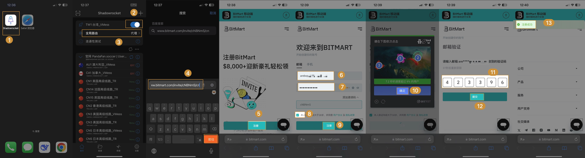
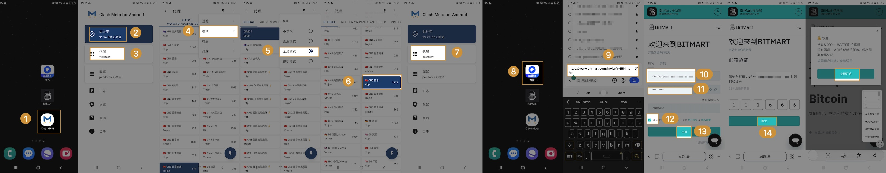

# 一.如何访问BitMart？
* https://www.bitmart.com/zh-CN  [需使用 VPN]
* https://www.bitmart.cool/zh-CN  [需使用 VPN]
* 访问BitMart的移动APP（iOS, Android ） [不需要 VPN]

# 二.无VPN，如何下载及安装BitMart手机App（iOS版/Android版）
## 1. iOS： 注册新的Apple ID，登录App Store，下载App  
详细步骤如下：
   
### 步骤一：访问苹果官方网站 https://appleid.apple.com/account

    

  
### 步骤二：点击右上角下拉菜单 >> 选择"创建你的 Apple ID"
* 请务必记住用来注册账户的邮箱、密码及手机号码。
* 目前除了荷兰,阿富汗,摩洛哥,印度,英国,中国大陆等不支持，其他都可选。

    

### 步骤三：选择"地区"，填写常用邮箱，提供能够收到验证码的手机号码。
* 请务必记住用来注册账户的邮箱、密码及手机号码。
* 在下图中荷兰,阿富汗,摩洛哥,印度,英国,中国大陆等不支持，目前BitMart APP暂不支持，其他都可选。

    

### 步骤四：输入邮箱和手机收到的验证码后，即可成功注册 Apple ID

    

### 步骤五：打开 App Store >> 登录新注册的 Apple ID 和密码

    

### 步骤六：登录成功 >> 点击 "搜索" >> 输入 "BitMart" >> 点击 "获取"

    

### 步骤七：点击“获取”BitMart App 后，可能需要以下步骤完成创建。创建完成后，BitMart App 将自动下载。

    

待补充：TestFight 下载BitMart App

## 2. Android：手机上通过链接下载APP
请务必通过官方渠道下载App，您可以直接复制以下链接到浏览器中打开，然后完成下载、安装。

* 下载链接1：https://www.bitmart.cool/static-file/resources/public/apk/bitmart.apk
* 下载链接2：https://static.bmxdefender.com/static-file/resources/public/apk/bitmart.apk

### 步骤一：复制链接，粘贴到浏览器(chrome浏览器,QQ浏览器,夸克浏览器,手机自带浏览器等) 下载  
### 步骤二：手机中找到下载后的apk安装包，点击按照包，即可安装。

#### 安卓系统下载BitMart App 视频教程：

#### 安卓系统下载BitMart App 图文教程：

#### 如果无法安装怎么办？
##### 1.华为手机安卓版
打开【自带浏览器】【复制链接】到浏览器中点击【前往】进行下载，遇到提示点击【继续安装】，最后界面上出现打开即表示安装完成。

2.华为手机鸿蒙版  
打开【自带浏览器】【复制链接】到浏览器中点击【前往】进行下载，遇到提示点击【仍要下载】，下载完成使用【卓易通】进行安装了，最后界面上出现APP即表示安装完成。

3.小米手机  
打开【自带浏览器】，将【复制链接】输入到浏览器中点击【->】进行下载，下载完成点击【安装】。最后界面上出现APP即表示安装完成。

4.红米手机  
打开【自带浏览器】，将【复制链接】输入到浏览器中点击【进入】进行下载，下载完成点击【打开】。如果遇到风险提示，则点击【单次安装授权】后就可以顺利安装了，最后界面上出现APP即表示安装完成。

5.OnePlus手机
打开【自带浏览器】，将【复制链接】输入到浏览器，浏览器会自动进行下载，下载完成点击【安装】。最后界面上出现APP即表示安装完成。

6.三星手机
打开【QQ浏览器】，将【复制链接】输入到浏览器中点击【进入】进行下载，下载完成点击【安装】。如果遇到提示，则进入【设置】，打钩【允许访问】后就可以顺利安装了，最后界面上出现APP即表示安装完成。

7.其他品牌/类型的安卓手机
以尝试以下方法安装App。
- 使用夸克浏览器或手机自带的浏览器下载安装
- 设置—【应用和通知】—【权限管理】—【安全和隐私】—【应用锁】—【信任此应用】—再下载安装，就不再出现“风险”提示。

# 三.如何注册 BitMart
## 1. 使用APP端 （无需VPN)
#### 步骤一：打开APP，选择注册，进入注册页面
#### 步骤二：输入【邮箱】【密码】，勾选用户协议，点击【注册】
#### 步骤三：进行图形验证，点击【确定】
#### 步骤四：进行邮箱验证码验证，输入【6位数验证码】点击下一步
#### 步骤五：提示【注册成功】表示您已经注册成功

## 2. 使用APP浏览器 （需要VPN，针对iOS版本)
* 注意：IP来自美国，香港，荷兰的用户会被禁止注册，如果您使用vpn，请不要代理到这些国家。

#### 步骤一：打开VPN软件【Shadowrocket】，线路选择【台湾/日本】，全局路由选择【代理】，然后开启【开关】
#### 步骤二：打开【safari浏览器】，复制邀请链接 https://www.bitmart.com/invite/cNBNmS/cn ，点【前往】，进入页面
#### 步骤三：页面中点击注册，界面会下拉到注册框，然后输入【邮箱和密码】，勾选【用户协议】，点击注册
#### 步骤四：进行【图形验证】，点击【确定】下一步
#### 步骤五：输入【邮箱验证码】，点击【提交】，当显示注册成功则表示已注册完成

## 3. 使用APP浏览器 （需要VPN，针对Android版本)
* 注意：IP来自美国，香港，荷兰的用户会被禁止注册，如果您使用vpn，请不要代理到这些国家。

#### 步骤一：打开VPN软件【Clash Meta】，开启【运行中】，点击【代理】->【模式】-> 【全局模式】，线路选择【日本】
#### 步骤二：打开【夸克浏览器】，复制邀请链接 https://www.bitmart.com/invite/cNBNmS/cn ，点【前往】，进入页面
#### 步骤三：页面中点击注册，界面会下拉到注册框，然后输入【邮箱和密码】，勾选【用户协议】，点击注册
#### 步骤四：进行【图形验证】，点击【确定】下一步
#### 步骤五：输入【邮箱验证码】，点击【提交】，当显示注册成功则表示已注册完成

# 四.Mac，Windows上开启VPN但是访问不了bitmart.com?
## 1. Mac，Windows端开启了VPN，但是依然访问不上bitmart.com，提示链接失败或者提示禁止访问(denied)
   访问YouTube，NetFlix 看是否成功，如果不成功，说明vpn代理失败，请检查vpn是否欠费等。
   

## 2. Mac，Windows端开启了VPN，访问YouTube正常，依然访问不上bitmart.com
   这说明你的vpn是正常工作的，但是bitmart.com没有经过代理。所以这时候你可以打开全局代理或者将bitmart.com加入到默认代理规则中。（不同vpn设置会有一些区别，但是功能是一样的）

## 3. Mac，Windows端开启了VPN，访问YouTube正常，也开启了全局模式，还是访问不了 bitmart.com, 那是因为有些VPN只代理 IPv4，不代理 IPv6 (类似快连VPN) ，需要设置禁用ipv6

#### 3.1 下面是不支持IPv6的VPN：
| 工具/VPN 名称                                | IPv6 代理支持      | 特点                  |
|------------------------------------------|----------------|---------------------|
| 快连VPN                                    | ❌ 不代理 IPv6     |                     | 国人常用，易泄露真实 IPv6 地址             |
| 蓝灯 Lantern                               | 	❌ 不代理 IPv6    | 	自动配置，兼容性好，但易漏 IPv6 |
| 赛风 Psiphon                               | 	❌ 不代理 IPv6    | 	类似蓝灯，注重“穿墙”，但非全局   |
| Turbo VPN（免费版）                           | 	❌ 不代理 IPv6    | 	手机上常见广告 VPN，风险高    |
| 一些浏览器插件类代理（如 SwitchyOmega 配 ShadowSocks） | 	❌ 默认不处理 IPv6	 | 需要手动设置或禁用 IPv6      |
| 大部分免费的 Shadowsocks 公共节点	                 | ❌ 默认不代理 IPv6	  | 如果服务端没配 IPv6，客户端直连  |

#### 3.2下面是支持IPv6的VPN：
| 工具/框架                             | IPv6 代理支持         | 特点                            |
|-----------------------------------|-------------------|-------------------------------|
| Clash / Clash Verge / Clash Meta	 | ✅ 支持 IPv6 策略	     | 推荐配置 “tun 模式 + 阻断 IPv6” 或显式代理 |
| Shadowrocket（iOS）                 | 	✅ 可设置 IPv6 全局代理	 | 可选项中设置「代理 IPv6」或「阻止 IPv6」     |
| WireGuard	                        | ✅ 完美支持 IPv6	      | 安全、轻量、跨平台，需服务端配置支持            |
| V2Ray / Xray-core                 | 	✅ 可配置 IPv6 路由	   | 高级玩法，支持度强，但配置稍复杂              |

#### 3.3 我都没有使用上面的VPN，我该如何检查是否遗漏 IPv6没有代理？
   打开这个网站测试：https://ipleak.net/
 
  

如果你看到：

    - 一个是 VPN 的 IPv4 地址（如日本/香港）
    - 另一个是 你运营商真实 IPv6 地址（中国） → 说明你 VPN 没代理 IPv6，真实地址被泄了。

**如果IPv6没有代理的问题，可以参考这个视频来禁用IPv6，让电脑只使用IPv4： https://www.youtube.com/watch?v=G7ON-rCDDw8**

#### 4.Mac，Windows，手机浏览器，不使用VPN是否可以访问BM官网吗？
不可以，需要使用VPN。

# 五.为什么在手机中点击邀请链接，会打不开或者提示网络连接失败、访问无效等
因为打开邀请链接是使用的手机浏览器，在app外访问还是需要开启vpn

# 六.Android设备上开启VPN但是访问不了bitmart.com?
- 检查VPN是否是打开状态。
- 设置「全局代理」 / 「tun」 模式开启。
- 允许后台运行。
- 虽然显示连上，但根本没通，更新VPN节点。
- 关闭 IPv6。（设置 → 移动网络 → APN → 当前接入点 → APN 协议改成 IPv4)

# 七.iOS设备上开启VPN但是访问不了bitmart.com?
- 检查是否为「全局」或「绕过中国」策略
- 确保开启了「代理 IPv6」或「阻止 IPv6」
- 建议使用iOS主流vpn客户端：Shadowrocket

# 八.Clash meta 如何开启全局代理？
图文教程如下：

