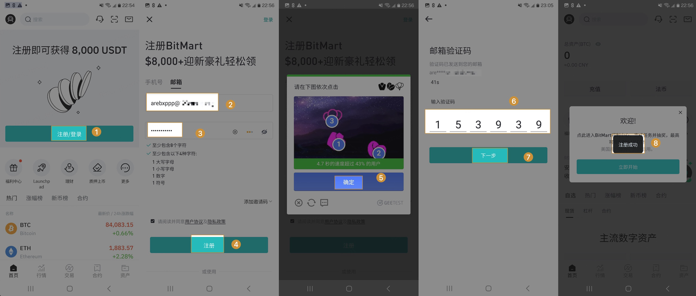
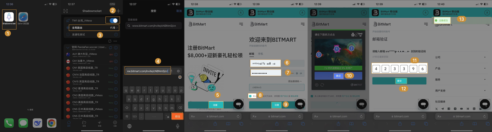
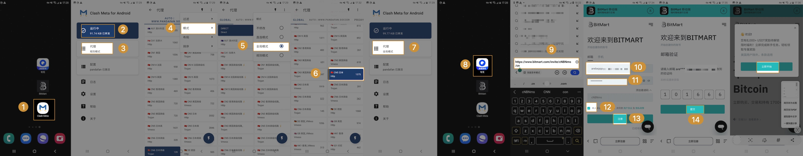

# 一.如何注册 BitMart
## 1. 使用APP端 （无需VPN)

* 步骤一：打开APP，选择注册，进入注册页面
* 步骤二：输入【邮箱】【密码】，勾选用户协议，点击【注册】
* 步骤三：进行图形验证，点击【确定】
* 步骤四：进行邮箱验证码验证，输入【6位数验证码】点击下一步
* 步骤五：提示【注册成功】表示您已经注册成功

## 2. 使用手机浏览器

#### 2.1 无VPN的方式

* 步骤一：打开APP的浏览器，输入网址 https://www.bitmart.com/register/zh-CN, 进入注册页面
* 步骤二：输入【邮箱】【密码】，勾选用户协议，点击【注册】
* 步骤三：进行图形验证，点击【确定】
* 步骤四：进行邮箱验证码验证，输入【6位数验证码】点击下一步
* 步骤五：提示【注册成功】表示您已经注册成功

#### 2.2 有VPN的方式

###### 2.2.1 使用iOS上的APP浏览器 （VPN)
    * 注意1：请使用固定的VPN线路，而不是随机。
    * 注意2：IP来自美国，香港，荷兰的用户会被禁止注册，如果您使用vpn，请不要代理到这些国家。

* 步骤一：打开VPN软件【Shadowrocket】，线路选择【台湾/日本】，全局路由选择【代理】，然后开启【开关】
* 步骤二：打开【safari浏览器】，复制邀请链接 https://www.bitmart.com/invite/cNBNmS/cn ，点【前往】，进入页面
* 步骤三：页面中点击注册，界面会下拉到注册框，然后输入【邮箱和密码】，勾选【用户协议】，点击注册
* 步骤四：进行【图形验证】，点击【确定】下一步
* 步骤五：输入【邮箱验证码】，点击【提交】，当显示注册成功则表示已注册完成

###### 2.2.2 使用Android上的APP浏览器 （需VPN)
    * 注意1：请使用固定的VPN线路，而不是随机。
    * 注意2：IP来自美国，香港，荷兰的用户会被禁止注册，如果您使用vpn，请不要代理到这些国家。

* 步骤一：打开VPN软件【Clash Meta】，开启【运行中】，点击【代理】->【模式】-> 【全局模式】，线路选择【日本】
* 步骤二：打开【夸克浏览器】，复制邀请链接 https://www.bitmart.com/invite/cNBNmS/cn ，点【前往】，进入页面
* 步骤三：页面中点击注册，界面会下拉到注册框，然后输入【邮箱和密码】，勾选【用户协议】，点击注册
* 步骤四：进行【图形验证】，点击【确定】下一步
* 步骤五：输入【邮箱验证码】，点击【提交】，当显示注册成功则表示已注册完成

