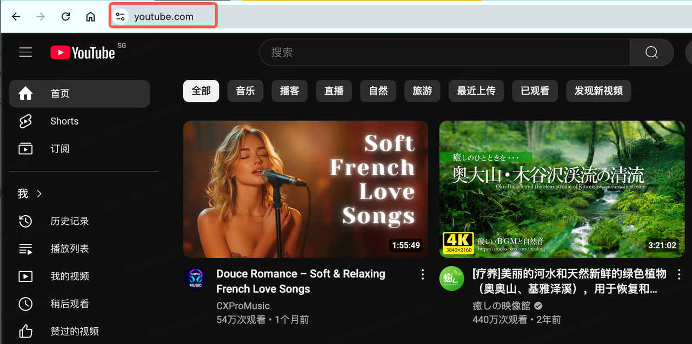

# 快连VPN相关问题
## 一.Mac，Windows上开启VPN但是访问不了bitmart.com?

#### 1. Mac，Windows端开启了VPN，但是依然访问不上bitmart.com，提示链接失败或者提示禁止访问(denied)
   访问YouTube，NetFlix 看是否成功，如果不成功，说明vpn代理失败，请检查vpn是否欠费等。
   

#### 2. Mac，Windows端开启了VPN，访问YouTube正常，也开启了全局模式，还是访问不了 bitmart.com, 那是因为有些VPN只代理 IPv4，不代理 IPv6 (类似快连VPN) ，需要设置禁用ipv6
可以参考这个视频来禁用IPv6，让电脑只使用IPv4： https://www.youtube.com/watch?v=G7ON-rCDDw8

## 二.Mac，Windows，手机浏览器，不使用VPN是否可以访问BM官网吗？
不可以，需要使用VPN。

## 三.为什么在手机中点击邀请链接，会打不开或者提示网络连接失败、访问无效等
因为打开邀请链接是使用的手机浏览器，在app外访问还是需要开启vpn

